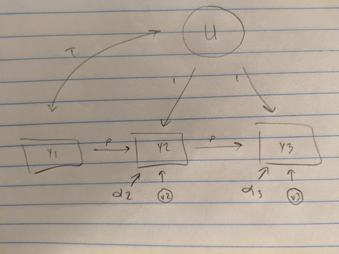

```{r setup, include=FALSE}
knitr::opts_chunk$set(echo = FALSE, warning = FALSE, message = FALSE)
library(tidyverse)
library(broom)
library(lavaan)
library(DiagrammeR)
library(knitr)

```


# Introduction

Kiley and Vaisey [-@kiley2020] recently published a method for assessing whether survey respondents appear to be changing their beliefs between waves or whether they instead appear to be repeating fixed responses with temporary local influences. This question is important because these processes reflect very different theoretical models of how "personal culture" operates [see @lizardo2017]. That is, if cultural beliefs are primarily public and responsive to external discourse, we should observe more updating as people respond to changes in their local environment. On the other hand, if cultural beliefs are primarily something learned early, then "settled dispositions" should be relatively resilient to local shocks [see also @vaisey2016].

In this paper, we build on @kiley2020 and introduce an alternative method for distinguishing between situations where respondents appear be actively updating their beliefs and situations where respondents' beliefs appear to be settled. This method, based on structural equation modeling, provides a close fit to the theoretical models outlined in @kiley2020 and provides even stronger support for their claim that most cultural beliefs reflect settled dispositions developed relatively early in life.

# Background

Kiley and Vaisey [-@kiley2020, hereafter KV] distinguish between two main models of cultural change implied in the literature: the *active updating model* and the *settled dispositions model*. The assumptions of each model are represented in Figure 1.

```{r mods, out.width="80%", fig.align='center', fig.cap='Theoretical Models'}
knitr::include_graphics("KVimage.png")

```

KV's goal is to develop a method that can distinguish between the two processes. They proceed by estimating the following equation on three-wave panel data:

\begin{equation}
  E(y_{i3}) = \alpha + \phi\beta y_{i2} + (1-\phi)\beta y_{i1} (\#eq:KVM)
\end{equation}

The intuition behind Equation \@ref(eq:KVM) is that, if people are updating their beliefs, survey responses that are closer in time (e.g., wave 1 and wave 2) should be more similar than responses that are more distant in time (wave 1 and wave 3). The $\phi$ parameter indicates the relative weight given to the more proximate wave 2 response ($\phi$) and the more distal wave 1 response ($1-\phi$). As $\phi$ approaches 1, wave 2 becomes more informative about wave 3 and wave 1 becomes less informative about wave 3, suggesting persistent change between waves. As $\phi$ approaches .5, however, both prior waves are assigned equal weight, suggesting that the answers reflect a persistent disposition to answer the question in a particular way.[^1]

[^1]: The $\beta$ parameter reflects the extent to which wave 3 is predictable from *any* combination of wave 1 and wave 2. Questions with low $\beta$ are simply "noisy."

Estimating this model on 183 variables from the 2006-2014 GSS panels, KV find that a high proportion of outcome variables show no evidence of active updating. Although they point out several exceptions (e.g., some questions about gay rights, where attitudes do appear to be changing over the study period) they conclude that the settled dispositions model is a better default for thinking about public opinion among adults.

# An alternative method

## From theoretical to statistical models

The alternative method we propose uses structural equation modeling to implement the theoretical graphs more directly. By estimating the model this way, we can compare a wide variety of model specifications that have different theoretical implications [see @bollen2010]. For example, we could specify the core graph of the settled dispositions model as follows:

\begin{eqnarray}
  y_{i1} = \alpha_1 + U_i + v_{i1} \\ 
  y_{i2} = \alpha_2 + U_i + v_{i2} \notag \\
  y_{i3} = \alpha_3 + U_i + v_{i3} \notag
\end{eqnarray}

From this basic version, we can add further constraints. For example we can constrain $\alpha_1 = \alpha_2 = \alpha_3$ if we are willing to assume that the mean response is the same at all waves. And we could constrain $\sigma^2_{v1} = \sigma^2_{v2} = \sigma^2_{v3}$ if we are willing to assume that the variance of the responses does not change over time.

This is not the place for a general overview of structural equation modeling [@bollen1989; see @kline2015 for an accessible introduction]. But the basic intuition in the three-wave case is that we are attempting to reconstruct 9 observed elements from the data (3 means, 3 variances, and 3 covariances) using a model with fewer than 9 parameters. For example, if we make the assumptions in Equation (2), including the equality constraints in the following paragraph, we can estimate a model that has only 3 parameters: one value of $\alpha$ (shared by all waves), one $\sigma^2_v$ (shared by all waves), and one $\sigma^2_U$. Here $U$ is a "latent variable," which, in this specification, simply means a person-specific "error" that gets added equally to a person's response at every wave. $U_i$ reflects an individual's unchanging tendency to respond to a certain question the same way over the study period (a "settled disposition").

Using this model will not work well to "predict" the data if the data were generated by a process that looks like the active updating model on the left of Figure 1. We could instead estimate the following model:

\begin{eqnarray}
  y_{i3} = \alpha_3 + \rho y_{i2} + v_{i3} \\ 
  y_{i2} = \alpha_2 + \rho y_{i1} + v_{i2} \notag
\end{eqnarray}

Here we cannot make $Y_1$ a dependent variable because we don't have its previous value ($Y_0$). Therefore we can only use it as a predictor. As above, we can make further simplifications if we want (e.g., $\alpha_2 = \alpha_3$ or $\sigma^2_{v2} = \sigma^2_{v3}$). Using this fully simplified version, we are estimating a model with 5 parameters: one value of $\alpha$ (shared by waves 2 and 3), one $\sigma^2_v$ (shared by waves 2 and 3), the $\rho$ autocorrelation parameter, and the mean and variance of $Y_1$.

If $Y_t$ were always measured perfectly, we could simply compare the penalized likelihoods (e.g., BICs) of the two models to see which is more likely to be the true model given the data [@bollen2014]. Unfortunately, most GSS items likely contain some measurement error. Any measurement bias--the systematic tendency for an item to over- or underestimate a person's "true" value--will induce error correlations between waves that have no basis in the causal process. Thus $U_i$ in Equation (2) represents both settled dispositions and respondent-specific measurement bias.

For this reason, the most reasonable specification of the active updating model combines features of equations (2) and (3):

\begin{eqnarray}
  y_{i3} = \alpha_3 + \rho y_{i2} + U_i + v_{i3} \\ 
  y_{i2} = \alpha_2 + \rho y_{i1} + U_i + v_{i2} \notag \\
  \text{Cov}(U,Y_1) = \tau \notag
\end{eqnarray}

Adding $U$ to equation (4) allows for systematic correlations between the wave 2 and wave 3 responses due to measurement bias or error.[^U_note] Estimating $\tau$, the covariance between $U$ and $Y_1$, reflects that $U$ and $Y_1$ share common unobserved causes (e.g., systematic measurement error, values of the pre-survey $Y_0$).

[^U_note]: Unfortunately, in the three-wave case there's no way to distinguish systematic measurement bias or error from true person-level stable differences as components of $U$ without additional untestable assumptions.

The most straightforward[^spec_note] way to compare models is to specify them as special cases of a more general model. Figure 2 shows the basic model.

```{r, out.width="300px", fig.cap="General Model", fig.align='center'}


```

[^spec_note]: We could specify an even more parsimonious version of the settled dispositions model by estimating Equation (2) with the equality assumptions discussed in the text. This would effectively be estimating a confirmatory factor analysis on $Y_t$. This would only require three parameters. We will revisit this later.

We have three basic choices to make:

1. Do we allow wave-to-wave updating of responses (estimate $\rho$)?
2. Do we allow for settled dispositions and systematic bias (estimate $\sigma^2_U$ and $\tau$)?
3. Do we allow wave-to-wave changes in the mean response (estimate $\alpha_2$ and $\alpha_3$ separately) or assume no aggregate change ($\alpha_2 = \alpha_3$)?

Crossing these three binary choices would normally lead to 8 candidate models. However, we exclude from consideration models that contain neither updating nor settled dispositions because no theoretical perspective argues for them. This leaves us with six models, shown below.

| Model | $\sigma^2_U$, $\tau$ | $\rho$ |$\alpha_t$ | # parameters |    
|:---	  |:---:                 |:---:   |:---:      |:---:         |
| AUM1  | 0  	                 | free   | =  	      | 5            |
| AUM2  | 0  	                 | free   | free  	  | 6            |
| AUM3  | free                 | free   | =  	      | 7            |
| AUM4  | free                 | free   | free  	  | 8            |
| SDM1  | free                 | 0  	  | =  	      | 6            |
| SDM2  | free                 | 0  	  | free  	  | 7            |

For any given three-wave panel, we can compare the fit of these models against each other to help determine which of the models is most likely to have generated the data.

## Advantages of the approach

@kiley2020 also compare estimates using Equation (1) with and without constraints to adjudicate between the active updating and settled dispositions accounts. The approach we outline here is essentially identical in spirit but a bit different in the details. The main difference is that KV compare models based solely on how well they "predict" the Wave 3 response. Using structural equation models allows comparing the fit of the model to all the observed data, not just the final response.

## Analytic strategy

We use the same 183 variables and three panels of the General Social Survey as @kiley2020. Rather than pool the panels, we estimate models separately on each one. Most variables appear in all three panels but 6 are measured in only one panel and one is measured in two panels. This gives us 536 total three-wave datasets.

For each of the 536 datasets, we estimate all 6 of the candidate models. We then compare fits using the Bayesian Information Criterion [BIC, see @raftery1995; @bollen2014]. In order to make the best case possible for each theoretical model, we will compare the best-fitting of the four AUM models with the best-fitting of the two SDM models. In cases where the BIC difference between the two "finalist" models is less than 2, we consider the evidence inconclusive [@raftery1995; @bollen2014].

\newpage

# Results

## BIC comparisons

```{r}
load("results.Rdata")
```

```{r}
winners <- results %>%
  filter(type != "CFA") %>% 
  group_by(variable, ds, type) %>% 
  filter(BIC == min(BIC)) %>% 
  group_by(variable, ds) %>% 
  mutate(BIC_diff = BIC - max(BIC)) %>% 
  filter(BIC == min(BIC)) %>% 
  mutate(verdict = if_else(BIC_diff >= -2, "Inconclusive", type)) %>% 
  ungroup()

win_table <- winners %>% 
  group_by(verdict) %>%
  summarize(wincount = n())

```

Figure \@ref(fig:winners) shows the results of these comparisons for all 536 variable-panels. One of the two SDM models is preferred for `r round(win_table[3,2]/sum(win_table[,2])*100)`% of cases, with one of the four AUM models preferred in `r round(win_table[1,2]/sum(win_table[,2])*100)`% of cases. The remaining cases are inconclusive.

```{r winners, fig.cap='Preferred Models according to BIC Comparison', fig.align='center'}

ggplot(win_table, aes(y = verdict, x = wincount)) +
  geom_bar(stat = "identity") +
  theme_minimal() +
  scale_y_discrete(labels = c("Active Updating", "Inconclusive", "Settled Dispositions")) +
  scale_x_continuous(limits = c(0, 450)) +
  labs(y = "",
       x = "Number of variable-panels")

```

```{r}
wins_by_var <- results %>%
  filter(type != "CFA") %>% 
  group_by(variable, ds, type) %>% 
  filter(BIC == min(BIC)) %>%
  group_by(variable, ds) %>%
  mutate(diff = abs(min(BIC) - max(BIC)), 
         winner = if_else(BIC==min(BIC), 1L, 0L)) %>%
  filter(diff > 2) %>% 
  filter(type=="SDM") %>%
  group_by(variable) %>% 
  summarize(panels = n(),
            mw = mean(winner)) %>% 
  filter(panels == 3) %>% 
  group_by(mw) %>% 
  summarize(count = n())
```

If we look at only variables measured in all three panels, we can also compare the number of variables where all three agree. There are `r wins_by_var[4,2]` variables that unanimously point to the SDM and only `r wins_by_var[1,2]` that unanimously favor the AUM. The three unanimous AUM variables are `news` (reading a newspaper), `owngun` (having a gun in your home), and `socbar` (going to a bar or tavern). The presence of `owngun` on this list is promising because we _know_ that physical objects act according to an active updating model -- when you buy a gun, it stays in your house until you get rid of it.

## Goodness-of-fit

```{r}
ok_fits <- winners %>% 
  filter(type == "SDM") %>% 
  mutate(ok_fit = if_else(rmsea < .08, 1L, 0L)) %>% 
  group_by(ok_fit) %>% 
  summarize(count = n()*100 / nrow(.))

less_than_08 <- results %>%
  filter(mod_spec == "CFA") %>% 
  mutate(OK_fit = rmsea < .08) %>% 
  group_by(OK_fit) %>% 
  summarize(prop = n()*100 / nrow(.)) %>% 
  .[2,2] %>% round(., 1)

less_than_05 <- results %>%
  filter(mod_spec == "CFA") %>% 
  mutate(OK_fit = rmsea < .05) %>% 
  group_by(OK_fit) %>% 
  summarize(prop = n()*100 / nrow(.)) %>% 
  .[2,2] %>% round(., 1)
  
```

Almost all (`r ok_fits[2,2] %>% round(.,1)` percent) of the preferred SDM models have acceptable fits (RMSEA < .08). But we can put the SDM to an even stronger test by estimating a model that assumes no change and no updating across waves. This is the model implied by Equation (2) and is equivalent to a simple confirmatory factor analysis with just three parameters: one value of $\alpha$ (shared by all waves), one $\sigma^2_v$ (shared by all waves), and one $\sigma^2_U$. In essence, this model assumes that each wave is a report of a fixed quantity determined before the time of the study.

Estimating this model shows that it fits `r less_than_08` percent of the variable-panels acceptably (RMSEA < .08) and `r less_than_05` percent of the variable-panels well (RMSEA < .05). Figure 4 shows the overall distribution of RMSEA values. We don't want to take these conventional cutoffs too literally [see @barrett2007], but altogether these results indicate that the majority of GSS items are highly compatible with the settled dispositions model.


```{r cfa, fig.cap="Distribution of Fit Values for Simple CFA"}
cfa_fits <- results %>% 
  filter(mod_spec == "CFA")

ggplot(cfa_fits, aes(x = rmsea)) +
  stat_ecdf(size = 1.2, alpha = .8) +
  geom_vline(xintercept = .05, linetype = "dashed") +
  geom_vline(xintercept = .08, linetype = "dotted") +
  labs(x = "RMSEA",
       y = "Cumulative Proportion") +
  theme_minimal()

```

# Discussion and Conclusions

We have presented a model-based approach to estimating...

\newpage

# References